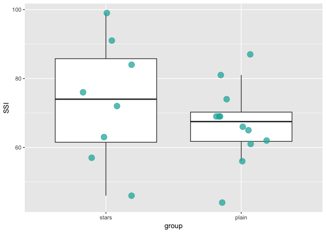
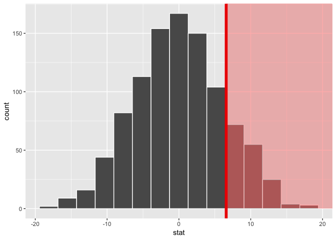

# Introduction

If you want to knit this .Rmd file, you'll need to load the `tidyverse` package. I use functions from `dplyr`, `tidyr`, and `ggplot2` specifically.


```r
library(tidyverse)
```


You have my permission to watch this video, stop it at 4 minutes 5 seconds:
https://www.youtube.com/watch?v=PdLPe7XjdKc

Let's play with some obviously fictitious data. Our outcome measure is the Sneetch Snootiness Index (SSI), which we measured for both plain-bellied sneetches (`plain`) and those with stars upon thars (`stars`). Here is our data for N = 20 sneetches, where I have SSI scores for m = 8 star-bellied sneetches and n = 12 plain-bellied sneetches.


```r
stars <- c(84, 57, 63, 99, 72, 46, 76, 91, rep(NA, 4))
plain <- c(81, 74, 56, 69, 66, 62, 69, 61, 87, 65, 44, 69)
sneetches <- data.frame(stars, plain)
sneetches_tidy <- sneetches %>%
  gather(group, SSI) %>%
  filter(!is.na(SSI))
sneetches_tidy
```

```
   group SSI
1  stars  84
2  stars  57
3  stars  63
4  stars  99
5  stars  72
6  stars  46
7  stars  76
8  stars  91
9  plain  81
10 plain  74
11 plain  56
12 plain  69
13 plain  66
14 plain  62
15 plain  69
16 plain  61
17 plain  87
18 plain  65
19 plain  44
20 plain  69
```


Let's look at our data for N = 20 sneetches, where I have SSI scores for m = 8 star-bellied sneetches and n = 12 plain-bellied sneetches.

<!-- -->


```r
sneetches
```

```
   stars plain
1     84    81
2     57    74
3     63    56
4     99    69
5     72    66
6     46    62
7     76    69
8     91    61
9     NA    87
10    NA    65
11    NA    44
12    NA    69
```

```r
obs_mean_diff <- with(sneetches, mean(stars, na.rm = TRUE) - mean(plain))
obs_mean_diff
```

```
[1] 6.583333
```

# Reshuffling

The basic idea to a permutation test is that we reshuffle the deck. Here the deck is our observed sample data, and when we reshuffle, we are re-ordering the samples according to the null hypothesis as if the group that each observation came from (`stars` versus `plain`) does not matter. First, imagine that all of our observed SSI scores are stored in one vector (both groups stacked on top of each other), and numbered 1 through 20 (regardless of group).


```r
sneetches_tidy
```

```
   group SSI
1  stars  84
2  stars  57
3  stars  63
4  stars  99
5  stars  72
6  stars  46
7  stars  76
8  stars  91
9  plain  81
10 plain  74
11 plain  56
12 plain  69
13 plain  66
14 plain  62
15 plain  69
16 plain  61
17 plain  87
18 plain  65
19 plain  44
20 plain  69
```

Next, we shuffle the non-missing observation numbers (rows 1:20), choosing a new `stars` group of size n = 8 from the n = 20 observed data points **without replacement**. Let's do this once, and you can see which 8 observations I select for my first resample:


```r
set.seed(0)
resample <- sample(20, size = 8, replace = FALSE) # sample of numbers from 1:30
resample # new stars group
```

```
[1] 18  6  7 10 15  4 13 14
```

These numbers represent rows in our `sneetches_tidy` dataset. Now, we say that these 8 observations are my new `stars` group- all the other 12 observations will therefore be assigned to my new `plain` group.


```r
sneetches_tidy %>%
  mutate(shuffled_group = ifelse(rownames(.) %in% resample, "stars", "plain"))
```

```
   group SSI shuffled_group
1  stars  84          plain
2  stars  57          plain
3  stars  63          plain
4  stars  99          stars
5  stars  72          plain
6  stars  46          stars
7  stars  76          stars
8  stars  91          plain
9  plain  81          plain
10 plain  74          stars
11 plain  56          plain
12 plain  69          plain
13 plain  66          stars
14 plain  62          stars
15 plain  69          stars
16 plain  61          plain
17 plain  87          plain
18 plain  65          stars
19 plain  44          plain
20 plain  69          plain
```

Now we need to create simple vectors with the SSI scores for each group.


```r
sneetch_ssi <- sneetches_tidy %>% 
  select(SSI)
sneetch_ssi[resample, ] # SSI scores for new stars group
```

```
[1] 65 46 76 74 69 99 66 62
```

```r
sneetch_ssi[-resample, ] # SSI scores for new plain group
```

```
 [1] 84 57 63 72 91 81 56 69 61 87 44 69
```

```r
mean(sneetch_ssi[resample, ]) - mean(sneetch_ssi[-resample, ]) # new mean difference
```

```
[1] 0.125
```

Remember, our observed mean is 6.5833333. So, this new resampled mean, calculated as if it didn't matter if the real `stars` were `stars`, is much smaller. Now, this was just one possible resample. How many possible ways are there to choose 8 observations from 20? 


```r
choose(20, 8)
```

```
[1] 125970
```

```r
# choose(20, 12) same thing
```

That is, there are 125970 possible permutations:
$$\binom{m + n}{m} = \binom{8 + 12}{8} = 125970$$


This number is not so crazy because we have pretty small sample sizes, but with real data, you'll often find the number of possible permutations is pretty unmanageable. So we make do with an approximation: we will take a large number of resamples, resampling **with replacement from the null distribution** of $\binom{m + n}{m}$ possible resamples. Sampling without replacement would be more accurate, but it would require too much time and memory to check the uniqueness of each resample. Long story short: we don't create **all possible resamples** in a permutation test, which is why this is referred to as a [Monte Carlo permutation test](https://en.wikipedia.org/wiki/Resampling_%28statistics%29#Monte_Carlo_testing).

# Permutation Testing

Let's pull 99,999 resamples, and recalculate the difference between means of a random sample of 8 (my new `stars`) versus 12 observations (my new `plains`) and see how often we observe a mean difference in SSI scores as or more extreme than the one we actually observed in our sample (6.5833333). Why 99,999? Because, as you'll see, we'll add one to both our numerator and denominator to calculate the p-value. Now, why do we that?! Well, you *did* actually collect one for real sample, so there is always at least one resample that is as extreme as your original sample- specifically, your original sample! So this allows us to avoid a potentially embarassing situation of getting a p-value equal to 0.


```r
set.seed(0)
B <- 10^5-1  #set number of times to repeat this process
resampled_mean_diff <- numeric(B) # space to save the random differences
for(i in 1:B){
  resample <- sample(20, size = 8, replace = FALSE) # sample of numbers from 1:20
  resampled_mean_diff[i] <- mean(sneetch_ssi[resample, ]) - mean(sneetch_ssi[-resample, ])
}
```


Let's plot the permutation distribution, which is the distribution of mean differences across all permutation resamples. 


```r
ggplot(data = NULL, aes(x = resampled_mean_diff)) +
  geom_histogram(binwidth = 1.25) +
  geom_vline(aes(xintercept = obs_mean_diff), colour = "dodgerblue") +
  ggtitle("Permuted mean differences in SSI scores")
```

<!-- -->

So here, what you are looking at, is our *new* null distribution- one that is *not* based on any distributional assumptions. Rather, this null distribution (the permutation distribution) is based on our sample data, and we ask "in how many permutation resamples did we get a [insert statistic here] as or more extreme than the one we got with our actual sample data?"

So, how many resampled mean differences are as or more extreme than the one we got?


```r
sum(resampled_mean_diff >= obs_mean_diff) # greater than or equal to
```

```
[1] 16602
```

```r
sum(resampled_mean_diff <= obs_mean_diff) # less than or equal to
```

```
[1] 84161
```

```r
min_sum <- min(sum(resampled_mean_diff >= obs_mean_diff), sum(resampled_mean_diff <= obs_mean_diff))
min_sum
```

```
[1] 16602
```

To calculate p-values, we calculate both one-sided p-values as a proportion with the total number of resamples + 1 in the denominator. For a two-tailed test, we multiple the *smaller* of these two p-values by 2, and if necessary round down to 1.0.


```r
#Compute P-value
min_p <- sum(min_sum + 1)/(B + 1)
c(min_p, 2*min_p)
```

```
[1] 0.16603 0.33206
```

"A difference of 6.6 is not significant at p = 0.05."

# Assumptions & Caveats

Permutation tests cannot solve all problems: they are valid only when the null hypothesis is 'no association'. Pooling the data to do a two-sample permutation test *does* require that the two *populations* (not necessarily samples) have the same distribution when the null hypothesis is true, that is, the mean, spread, and shape are the same. But you should feel fairly confident that, for example, there is not bias present in one sample. Like all methods, it will only work if your samples are representative - always be careful about selection biases! You may also get into dangerous territory if you have sample sizes in your two groups that are pretty uneven (also known as unbalanced), and this is accompanied by group differences in spread. When groups are the same size, the Type I error rate is typically close to the nominal level, otherwise it can be too high or too low.


